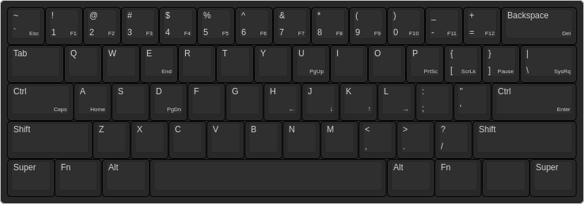

Kestrel
=======

Kestrel is a symmetric and realistic qwerty variant.

The goal is to maximize comfort and speed for compact keyboard and
keyboard-centric softwares.

The Layout
----------

Features
--------

- Symmetric Ctrl keys at the home row
- Symmetric modifier keys at the bottom row
- Easy to remember Fn layer

Keyboard Layout Editor
----------------------

The JSON file can be imported to <http://www.keyboard-layout-editor.com>.

Unused Key
----------

The unused key next to right Fn is reserved for keyboard specific key. (E.g. Pn)

Version
-------

1.0.0

License
-------
MIT
